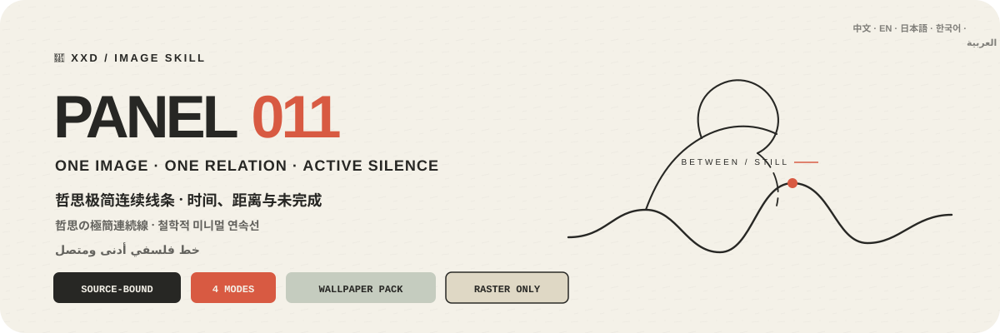

<p align="center">
  
</p>

<div align="center">

# 🦁 XXD Panel 011

### 写真を、ゆっくり見つめられる哲学的な極簡連続線へ

[](./SKILL.md)
[](#4つの出力を支えるひとつの哲思線ロジック)
[](#境界と信頼性)

<a href="README.md">简体中文</a> · <a href="README.en.md">English</a> · <strong>日本語</strong> · <a href="README.ko.md">한국어</a> · <a href="README.ar.md">العربية</a>

</div>

> 一つの核となる像 · 一組の関係 · 連続する黒線 · 能動的な余白 · 一点の記憶色

XXD Panel 011 は、Codex と互換 Agent のための画像生成 Skill です。主体の個性、輪郭、姿勢、重要な関係を保ち、写真の感情的緊張、空間関係、動作方向、距離、状態、または根拠ある比喩を一つの視覚命題へ凝縮し、少数の細く流れる自然な黒い連続線で再構成します。

線の停止、呼吸、密度、ずれ、延長、重なり、交差、未完が物語を担います。白または温かな紙色の余白は時間、距離、孤独、親密さ、待つこと、流れを表し、写真から取った一点だけの色は残された記憶として働きます。文字は線と共に構成されるアートブックの注記です。

## なぜ 011 が必要なのか

一般的な「極簡線画」は、美しいが空虚な装飾曲線、機械的な一筆描き、どの写真にも使える哲学記号へ崩れがちです。

011 は順序を逆にします。

```text
元写真の個性と関係を固定 → 最も意味ある感情／空間／方向／距離の命題を選ぶ → 冗長さを消して一つの核像へ → 停止、距離、接続、ずれ、延長、重なり、未完で連続線を組む → 余白に時間を担わせる → 記憶色を一点だけ残す → 文字を線構造へ入れる
```

無関係な写真に替えても核像、関係距離、線路、停止、交差、記憶色、文言がほぼ成立するなら、それは 011 ではありません。

## 011 のビジュアル契約

- **一つの核像：** 写真固有の手掛かりを三つ以上残し、個性、輪郭、姿勢、動き、構造、関係を保ちます。
- **一つの精神命題：** 最も意味ある感情的緊張、空間関係、動作方向、距離、状態、根拠ある比喩だけを抽出します。
- **細い連続黒線：** 自然に流れる線が停止、呼吸、密度、摩擦、ためらい、リズム、未完を持ちます。
- **変化には根拠：** 省略、接続、ずれ、延長、重なり、交差、開いた終端はすべて写真に由来します。
- **余白が語る：** 白または温かな紙色が主で、主体は小さく、ずれ、切れ、浮遊でき、余白が時間と距離を担います。
- **記憶色は一点：** 写真由来のごく小さな色を物、節点、線分、光点、関係焦点の一つだけに置きます。
- **アートブックの小文字：** 短い題と1〜2組の小文字を線沿い、線端、余白、輪郭、または線の基線へ組み込みます。

## 作例 · 近日追加

リポジトリには将来の作例用に [`assets/examples/`](assets/examples/) を用意しています。プロジェクト作者が確認した 011 の完成作品だけを追加し、それまでは別スタイルの投稿や画像を代用しません。

将来の作例は 011 の応用範囲を示すだけで、主体、比喩、配色、文言、画角が生成参照や既定値になることはありません。

## 4つの出力を支えるひとつの哲思線ロジック

4つのモードは単独でも複数でも選択できます。`1`、`1+3`、`1、2、4`、`全部` と返信すると、Skill が重複を除き 1→4 の順で実行します。各モードは別々のタスクフォルダに独立出力され、一覧画像にはまとめません。`全部` は元写真1枚につき7点（通常3モード各1点＋壁紙4点）です。サイズはモード名付きで同時指定でき、未指定の通常モードは元画像に適応します。文案は既定で選択モード間に共通し、モード別指定も可能です。

| モード | サイズ方針 | 成果物 |
| --- | --- | --- |
| `top-bottom` | 元画像適応 | 上に完全な元写真、下に 011 の哲思極簡連続線。両パネルは元画像サイズを保ち、厳密に 50/50 |
| `left-right` | 元画像適応 | 左に完全な元写真、右に 011 の哲思極簡連続線。両パネルは元画像サイズを保ち、厳密に 50/50 |
| `design-only` | 元画像適応 | 元写真を見せず、変化デザインだけを表示。元画像の比率と寸法を維持 |
| `wallpaper-pack` | 端末別4サイズ | スマートフォン、iPad、デスクトップ、子ども用ウォッチの PNG を個別出力 |

優先順位は、正確な指定ピクセル > 指定比率／用途 > 通常モードの元画像適応です。原稿 `011.md` の 3:4 は初期の制作画角であり、現在の暗黙の既定値ではありません。

ペアモードの写真は、抑制した調色と必要最小限の環境拡張だけで忠実さを保ちます。デザイン単独と壁紙では写真を根拠として使いますが、原片は表示しません。

### 壁紙セット：連動または独立

壁紙に暗黙のサイズ既定値はありません。一般プリセットはスマートフォン `1440×3200`、iPad `2048×2732`、デスクトップ `3840×2160`、ウォッチ `1024×1024`。端末別のカスタムサイズも指定できます。

- **連動セット（推奨）：** まず iPad の基準作品を生成・承認し、残り3枚は元写真＋同じ基準作品を参照して各画面に再構成します。
- **独立4作品：** 各端末は元写真だけを参照し、核像の位置、関係距離、線路、停止のリズム、記憶色、文字関係を別々に探れます。

連動は切り抜きではありません。4枚を個別に生成、構成、検査し、iPad→スマートフォン→デスクトップ→ウォッチの順に参照を連鎖させません。

## 文字は線の中のアートブック注記

生成前に、自動文案、カスタム文案、文字なしを選びます。文字を入れる場合は対象言語または地域も指定します。

自動文案は、写真から見える、または根拠のある感情、関係、動き、時間、距離、状態、比喩からごく短い題を作ります。哲学的、詩的、瞑想的でも、人生物語を捏造したり意味を押しつけたりしません。

必要に応じて1〜2組の小注、番号、抑制した哲思短句を加えます。日付、場所、出典、番号はユーザー提供または確実な根拠が必要で、洗練を装うために捏造しません。

ユーザーが完成稿を渡した場合は一字一句保ちます。方向や編集可能な草稿の場合だけ、対象、目的、必須語、語調、含意を守りながら磨きます。

言語は命令文ではなく、想定する読者に従います。

```text
対象市場・読者 > 指定された成果物言語 > 方向指示の言語；不明なら生成前に確認
```

日本版は自然な現代日本語、韓国向けは自然な韓国語と正しい分かち書き、英国版は英国英語、アラビア語版は原則として自然な現代標準アラビア語と正しい右から左の組版を使います。外見、服装、風景、看板から国籍を推測せず、雰囲気づくりの偽外国語も使いません。

## 正確な幾何はコード、作品は画像生成

画像モデルが写真に結びついた核像と関係、細い連続線、停止と未完、能動的な余白、一点の記憶色、アートブックの小文字を作ります。`scripts/compose_panel.py` は画布計画、厳密な 50/50 ラスター合成、最終寸法、監査だけを担当し、プログラム描画で作品を偽装しません。

```bash
python3 scripts/compose_panel.py --plan --layout top-bottom --source photo.png
python3 scripts/compose_panel.py --plan --layout left-right --size 2560x1440
python3 scripts/compose_panel.py --audit result.png --layout design-only --size 2048x2048
```

正確な上下構成は総高さ、左右構成は総幅が偶数である必要があります。指定ピクセルは勝手に変更されません。

## 使い始める

```bash
git clone https://github.com/nevertoday/xxd-panel-011.git
mkdir -p ~/.codex/skills
ln -s "$(pwd)/xxd-panel-011" ~/.codex/skills/xxd-panel-011
```

Claude Code では同じフォルダを `~/.claude/skills/xxd-panel-011` にリンクできます。インストール後に Agent セッションを再起動してください。

```text
$xxd-panel-011
この写真を左右二連にしてください。文案は写真の意味から作り、自然な韓国語を使ってください。
```

写真だけでも呼び出せます。番号付きの複数行メニューでモードと文字設定を確認し、壁紙では連動／独立と端末サイズも確認します。

詳細仕様：

- [Skill ワークフロー](SKILL.md)
- [中国語の完全プロンプト](references/xxd-panel-011-prompt.zh-CN.md)
- [英語の完全プロンプト](references/xxd-panel-011-prompt.en.md)
- [元のスタイル指示](references/011-source.md)

## 境界と信頼性

- 各写真は独立したタスク内だけで使い、他の入力、旧成果物、作例の主題、色、文案、構図を借りません。
- 呼び出すたびに新しいタスクフォルダを作り、同じ原画像と条件でも新たに生成します。
- 成果物は PNG ビットマップであり、SVG、HTML、Canvas、プログラム描画の代替物ではありません。
- 設定済みビットマップブリッジは匿名化した状態だけを返し、プロバイダー、エンドポイント、ヘッダー、認証情報、プロンプト、応答本文を表示しません。
- 選択した通常モードごとに1点を返し、`wallpaper-pack` を選ぶと独立壁紙4点を追加します。`全部` は元写真1枚につき7点を4つの同階層モードフォルダへ出力し、一覧コラージュにはまとめません。

ローカル合成には Python 3 と Pillow が必要です。安全なビットマップブリッジは Python 3.11+ の `tomllib` を使用します。画像生成には、ホスト Agent の内蔵ラスター生成機能または設定済みの互換ルートが必要です。

## リポジトリ

```text
xxd-panel-011/
├── SKILL.md
├── README.md / README.en.md / README.ja.md / README.ko.md / README.ar.md
├── agents/openai.yaml
├── assets/banner.svg + examples/（今後のローカル作例用）
├── scripts/compose_panel.py + configured_imagegen.py
└── references/xxd-panel-011-prompt.zh-CN.md + xxd-panel-011-prompt.en.md + 011-source.md
```

## XXD について

XXD は小小東（Xiaoxiaodong）のブランド名の略称です。このプロジェクトは [@xiaoxiaodong01](https://x.com/xiaoxiaodong01) が制作・管理しています。

## サポートと会員制度

### 個別深度相談 · 1時間 CNY 299

Skills 利用に関する一対一相談は1時間 CNY 299です。下の WeChat QR コードから予約してください。

### Xiaoxiaodong Skills ユーザー交流グループ · CNY 99

一度 CNY 99 を支払うと、ワークフロー共有、作品相談、ユーザー同士の支援を行う交流グループに参加できます。時間制の個別相談は含まれません。

### 知識星球＋会員プロンプトライブラリ · 年額 CNY 699

[知識星球](https://wx.zsxq.com/group/15554814142882)と[XXD 会員プロンプトライブラリ](https://vip.xiaoxiaodong.ai/)は同じ会員権です。**一度の年額決済で両方を利用でき、二重の購入は不要です。**

1. 知識星球で加入後、WeChat でプロンプトライブラリの交換コードを受け取る。
2. プロンプトライブラリで加入後、WeChat で知識星球への招待を受け取る。

<p align="center">
  <a href="https://xiaoxiaodong.pages.dev/assets/wechat-qr.png"></a>
</p>

<div align="center">

**写真を線画にせず、一本の線に時間、距離、語り切れない関係を残す。**

</div>

---

<div align="center">
  <h2>☕ オープンソースプロジェクトを支援</h2>
  <p>このプロジェクトが時間の節約になったなら、Star、共有、コーヒー一杯で継続を支援できます。</p>
  <table><tr><td align="center" width="240">
    <a href="https://github.com/nevertoday/zhongguo-traditional-colors/blob/main/docs/images/buy-me-a-coffee-qr.png?raw=true"></a><br>
    <strong>Buy me a coffee</strong><br><sub>QR コードを読み取るか開いて支援できます</sub>
  </td></tr></table>
  <p><sub>支援は任意であり、このオープンソースプロジェクトの利用権には影響しません。</sub></p>
</div>
